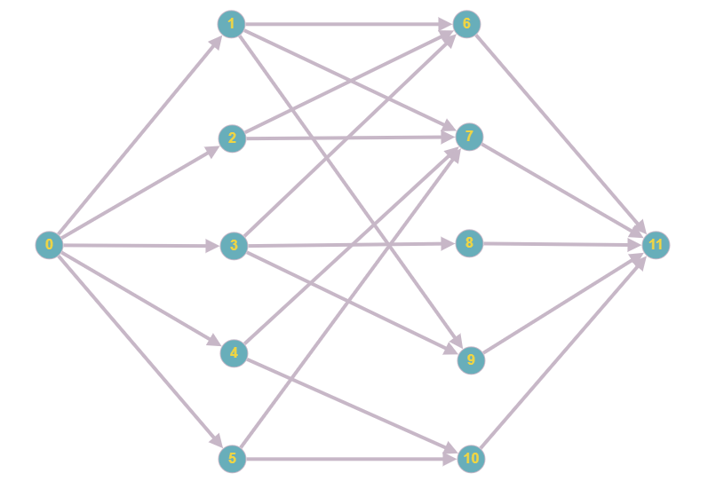

# Graph Theory Project

My implementation of Ford-Fulkerson method for Maximum Flow Problem written in python.

## Requirements
Make sure you have installed all of the following prerequisites on your machine:
* Git - [Download Git](https://git-scm.com/downloads) (OSX and Linux machines typically have this already installed.)
* Python - [Download Python](https://www.python.org/getit/)

## Setup

The first thing to do is to clone the repository:

```sh
git clone https://github.com/sn3ak1/GraphTheoryProject.git
```
Then go to the project directory
```
cd GraphTheoryProject
```

## Usage

Import graph by putting adjacency matrix in `data.txt`

Example data.txt content:
```
0, 1, 0, 2, 0,
0, 0, 1, 0, 0,
0, 0, 0, 0, 2,
0, 0, 1, 0, 1,
0, 0, 0, 0, 0,
```
You can generate graphs in this format here: <https://graphonline.ru/en/>

Run the algorithm by typing:
```sh
python main.py
```
Next script will ask to provide source node index. If you click enter without typing anything first node will be chosen as source.  
Similarly, with the sink node but last node is default.

The output will be maximum flow and paths taken. Edges in path are represented by: \[start node, end node, flow/capacity]

## Example of application
As stated in the introduction this algorithm solves Maximum Flow Problem, which can be used to deal with Bipartite realization problem.

Lets say some students got job offers and we are looking for a way to match them.

* Student 1:
    * Job 1
    * Job 2
    * Job 4
* Student 2:
    * Job 1
    * Job 2
* Student 3:
    * Job 1
    * Job 3
    * Job 4
* Student 4:
    * Job 2
    * Job 5
* Student 5:
    * Job 2
    * Job 5

It can be represented by a graph:  
  
With adjacency matrix:
```
0, 1, 1, 1, 1, 1, 0, 0, 0, 0, 0, 0, 
0, 0, 0, 0, 0, 0, 1, 1, 0, 1, 0, 0, 
0, 0, 0, 0, 0, 0, 1, 1, 0, 0, 0, 0, 
0, 0, 0, 0, 0, 0, 1, 0, 1, 1, 0, 0, 
0, 0, 0, 0, 0, 0, 0, 1, 0, 0, 1, 0, 
0, 0, 0, 0, 0, 0, 0, 1, 0, 0, 1, 0, 
0, 0, 0, 0, 0, 0, 0, 0, 0, 0, 0, 1, 
0, 0, 0, 0, 0, 0, 0, 0, 0, 0, 0, 1, 
0, 0, 0, 0, 0, 0, 0, 0, 0, 0, 0, 1, 
0, 0, 0, 0, 0, 0, 0, 0, 0, 0, 0, 1, 
0, 0, 0, 0, 0, 0, 0, 0, 0, 0, 0, 1, 
0, 0, 0, 0, 0, 0, 0, 0, 0, 0, 0, 0, 
```
After running the script we would get this output:
```
Maximum flow: 5
Paths taken: 
[[0, 5, '1/1'], [5, 10, '1/1'], [10, 11, '1/1']]
[[0, 4, '1/1'], [4, 7, '1/1'], [7, 11, '1/1']]
[[0, 2, '1/1'], [2, 6, '1/1'], [6, 11, '1/1']]
[[0, 1, '1/1'], [1, 9, '1/1'], [9, 11, '1/1']]
[[0, 3, '1/1'], [3, 8, '1/1'], [8, 11, '1/1']]
```
From which we know Student 1 should take Job 4, Student 2 - Job 1, Student 3 - Job 3, Student 4 - Job 2 and Student 5 - Job 5.